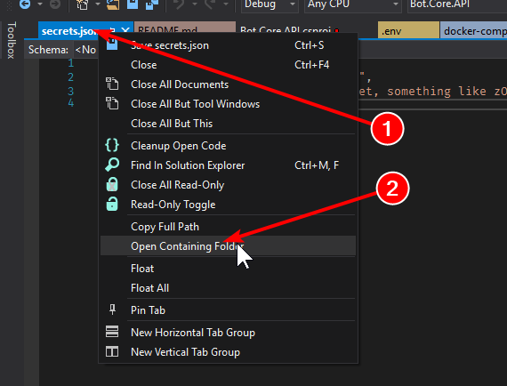

# eShop-AI Bot

## Setting up bot secrets

To avoid handling bot secrets in source control we use the [User Secrets feature](https://docs.microsoft.com/aspnet/core/security/app-secrets?view=aspnetcore-2.2&tabs=windows) of ASP.NET Core, with a twist.

The User Secrets feature allows overriding configuration parameters from the `appsettings.json` file with values taken from a user folder out of the project folder tree.

We´ll be using the user secrets folder to keep

To enable the User Secrets feature for a project:

1. On the project in the Solution Explorer in Visual Studio, select **Right-Click > Manage User Secrets** to:

   - Add the **PropertyGroup > UserSecretsId** key to the project file, with a GUID.
   - Create the `%APPDATA%\Microsoft\UserSecrets\{GUID}` folder
   - Add the `secrets.json` file to the folder
   - Open the secrets.json file in the editor.

Open the secrets folder and copy there the **Bot.Core.API.bot** file with the 



Configure the **Bot.Core.API.bot** file with the bot and LUIS secrets, you can leave the endpoint's appId and appPassword empty for local development and local Docker deployment:

```json
{
  "name": "eShopOnContainersAI-Bot.Net.Core",
  "secretKey": "",
  "services": [
    {
      "type": "endpoint",
      "name": "development",
      "id": "1",
      "endpoint": "http://localhost:6654/api/messages",
      "appId": "",
      "appPassword": ""
    },
    {
      "type": "endpoint",
      "name": "production",
      "id": "2",
      "endpoint": "http://172.21.0.17:5135/api/messages",
      "appId": "",
      "appPassword": ""
    },
    {
      "id": "3",
      "type": "luis",
      "name": "eShopAI-LUIS",
      "version": "2.0",
      "appId": "<your-luis-app-id>",
      "authoringKey": "<your-luis-authoring-key>",
      "subscriptionKey": "<your-subscription-key>",
      "region":  "<luis-app-region (westus, westeurope, etc.)>"
    }
  ],
  "padlock": "",
  "version": "2.0"
}
```